<p align="center">
  
</p>

<h1 align="center">Gandiva AI</h1>

<p align="center">
  <strong>Next-Generation AI Career Acceleration & Placement Readiness Platform</strong>
</p>

<p align="center">
  <a href="#overview"></a>
  <a href="#technology-stack"></a>
  <a href="#technology-stack"></a>
  <a href="#technology-stack"></a>
  <a href="#technology-stack"></a>
</p>

---

## Overview

**Gandiva AI** is an intelligent career acceleration and placement readiness ecosystem. It bridges the gap between academic curriculum and tier-1 tech hiring standards through integrated **AI resume engineering**, **adaptive technical assessments**, **voice-interactive mock interviews**, **context-aware personalized roadmaps**, and **real-time internship matchmaking**.

### Solution Overview
* **Technical Assessments:** Adaptive algorithmic and domain-specific quiz engine with topic diagnostics.
* **Mock Interviews:** Voice-interactive, proctored mock interview simulator with speech recognition (STT) and AI audio synthesis (TTS).
* **Resume Engineering:** Google XYZ formula bullet point optimization, ATS parsing, and keyword gap analysis.
* **Job Discovery:** Live Adzuna API job aggregation with candidate skill-matching index.

---

## System Methodology & Architecture

Gandiva AI utilizes a modular asynchronous architecture orchestrating multi-step AI reasoning pipelines, knowledge grounding, and a reactive frontend client.

```mermaid
flowchart TD
    %% Styling
    classDef client fill:#0f172a,stroke:#38bdf8,stroke-width:2px,color:#fff;
    classDef gateway fill:#064e3b,stroke:#10b981,stroke-width:2px,color:#fff;
    classDef ai fill:#1e1b4b,stroke:#818cf8,stroke-width:2px,color:#fff;
    classDef storage fill:#3b0764,stroke:#c084fc,stroke-width:2px,color:#fff;
    classDef external fill:#451a03,stroke:#f59e0b,stroke-width:2px,color:#fff;

    subgraph ClientLayer ["Frontend Client (React 19 + TypeScript + Vite)"]
        UI_Dash["Dynamic Dashboard"]:::client
        UI_Resume["Resume Builder & ATS Scanner"]:::client
        UI_Quiz["Adaptive Quiz Hub"]:::client
        UI_Interview["Proctored Voice Interview"]:::client
        UI_Roadmap["Career Roadmaps"]:::client
        UI_Jobs["Internship Matcher"]:::client
    end

    subgraph APILayer ["FastAPI Gateway & Middleware"]
        AuthRouter["Auth & Profile (JWT / HttpOnly)"]:::gateway
        AnalyticsEngine["Placement Readiness Engine"]:::gateway
        ResumeRouter["Resume & ATS Pipeline"]:::gateway
        QuizRouter["Quiz Generation & Evaluation"]:::gateway
        InterviewRouter["Proctored Session Manager"]:::gateway
        RoadmapRouter["Context-Aware Roadmap Router"]:::gateway
        JobsRouter["Job Aggregator Router"]:::gateway
    end

    subgraph AIServices ["AI & Reasoning Layer"]
        GeminiFlash["Gemini 2.5 Flash Engine"]:::ai
        XYZCoach["Google XYZ Bullet Enhancer"]:::ai
        ATSParser["PDF Parser & ATS Keyword Analyzer"]:::ai
        QuizGen["Adaptive Question Generator"]:::ai
        EvalAgent["Interview Evaluation Agent"]:::ai
        RAGRoadmap["Resume Context-Aware Roadmap Agent"]:::ai
    end

    subgraph DataStorage ["Persistence & Cache Layer"]
        SQLiteDB[("SQLite Database (Users, Resumes, Quizzes, Interviews)")]:::storage
        RedisCache[("Redis Cache (Sessions, OTPs, Aggregation Cache)")]:::storage
    end

    subgraph ExternalServices ["External Services"]
        AdzunaAPI["Adzuna Global Job Aggregator"]:::external
        WebSpeech["Web Speech API (STT / TTS)"]:::external
    end

    %% Client to API Connections
    UI_Dash --> AnalyticsEngine
    UI_Resume --> ResumeRouter
    UI_Quiz --> QuizRouter
    UI_Interview --> InterviewRouter
    UI_Roadmap --> RoadmapRouter
    UI_Jobs --> JobsRouter
    UI_Interview <--> WebSpeech

    %% API to AI Services
    ResumeRouter --> ATSParser
    ResumeRouter --> XYZCoach
    XYZCoach --> GeminiFlash
    ATSParser --> GeminiFlash

    QuizRouter --> QuizGen
    QuizGen --> GeminiFlash

    InterviewRouter --> EvalAgent
    EvalAgent --> GeminiFlash

    RoadmapRouter --> RAGRoadmap
    RAGRoadmap --> GeminiFlash

    JobsRouter --> AdzunaAPI

    %% API to Data Storage
    AuthRouter <--> SQLiteDB
    AuthRouter <--> RedisCache
    AnalyticsEngine <--> SQLiteDB
    ResumeRouter <--> SQLiteDB
    QuizRouter <--> SQLiteDB
    InterviewRouter <--> SQLiteDB
    RoadmapRouter <--> SQLiteDB
    AnalyticsEngine --> JobsRouter
```



---

## Placement Readiness Score Methodology

The **Placement Readiness Index** is a mathematical model aggregating five multi-dimensional evaluation vectors to measure holistic hiring readiness:

$$\text{Placement Score} = 0.30 \cdot \text{ATS} + 0.25 \cdot \text{Quiz} + 0.20 \cdot \text{Interview} + 0.15 \cdot \text{Projects} + 0.10 \cdot \text{Skills}$$

| Component | Weight | Metric Source | Description |
| :--- | :---: | :--- | :--- |
| **Resume ATS Score** | **30%** | `models/resume_analysis.py` | ATS compatibility, keyword density, and structural parsing quality. |
| **Quiz Accuracy** | **25%** | `models/quiz.py` | Accuracy and topic-level mastery across timed technical assessments. |
| **Interview Evaluation** | **20%** | `models/interview.py` | Rubric scoring on technical accuracy, communication, and depth. |
| **Projects Quality** | **15%** | `models/resume.py` | Quality, breadth, tech stack relevancy, and implementation depth. |
| **Skill Match Index** | **10%** | `routes/analytics.py` | Ratio of candidate skills matching target industry benchmarks. |

---

## Core Features & Functional Modules

### 1. Unified Analytics Cockpit (`/dashboard`)
- **Real-Time Readiness Meter:** Live placement score calculation with breakdown details.
- **Metric Cards:** Instant tracking of ATS rating, quiz accuracy percentage, and interview performance.
- **Identified Skill Gaps:** Surfaces missing competencies from ATS scans and weak assessment topics.
- **Contextual Action Recommendations:** AI-prioritized next steps that adapt dynamically as candidates progress.

### 2. AI Resume Builder & ATS Scanner (`/resumes`)
- **Multi-Step Builder:** Sections for Personal Info, Education, Experience, Projects, Skills, Achievements, and Certifications.
- **Google XYZ Formula Enhancer:** Rewrites bullet points into measurable accomplishment statements using active verbs.
- **Instant ATS Parser:** Extracts and structures data from uploaded PDF resumes.
- **Keyword Gap Analysis:** Highlights missing technical skills, formatting warnings, and targeted improvements.

### 3. Proctored AI Mock Interview (`/interviews`)
- **Speech Synthesis (AI Voice Narrator):** Reads interview questions aloud with playback and mute controls.
- **Web Speech Recognition (Voice Input):** Live speech-to-text dictation into candidate answer drafts.
- **Proctored Fullscreen Interface:** Anti-distraction full-screen mode with elapsed timer and question map.
- **Rubric Evaluation:** Evaluates candidate answers on technical accuracy, structure, and communication.

### 4. Adaptive Quiz Assessment (`/quizzes`)
- **AI Question Generation:** Custom quizzes generated dynamically based on topic, difficulty, and question count.
- **Timed Assessment Interface:** Response tracking, score computation, and answer explanations.
- **Attempt History & Diagnostics:** Historical accuracy trends to track topic improvements over time.

### 5. Context-Aware Roadmaps (`/roadmaps`)
- **Personalized Curriculum:** Uses candidate's latest resume and target role to generate structured learning phases.
- **Milestone Checklist:** Interactive task tracking with status management and reference materials.

### 6. Live Internship Aggregator (`/internships`)
- **Adzuna API Integration:** Live job and internship search across categories and locations.
- **Candidate Skill Matching:** Match percentage calculated against candidate competencies.

---

## Technology Stack

```
Gandiva AI Architecture
├── Frontend: React 19, TypeScript, Vite, Tailwind CSS, Lucide Icons
├── Backend: FastAPI, Python 3.11, SQLAlchemy ORM, Pydantic v2, Starlette
├── AI Engine: Google GenAI SDK (gemini-2.5-flash), Structured JSON Prompting
├── Data & Cache: SQLite 3, Redis 6379, PyPDF2
└── External Integrations: Adzuna Job Aggregator API, Web Speech API
```

---

## Getting Started

### Prerequisites
- **Node.js:** v18.0 or higher
- **Python:** v3.10 or v3.11
- **Redis:** Local or cloud instance running on port `6379`
- **Google Gemini API Key:** Accessible via Google AI Studio

---

### Environment Variables

Create `.env` inside `backend/`:

```env
# Database & Cache
DATABASE_URL=sqlite:///./app.db
REDIS_HOST=localhost
REDIS_PORT=6379

# Authentication (JWT)
SECRET_KEY=your_super_secret_jwt_key_32_characters
ALGORITHM=HS256
ACCESS_TOKEN_EXPIRE_MINUTES=1440

# AI Engine
GEMINI_API_KEY=your_gemini_api_key

# Job Aggregator (Adzuna)
ADZUNA_APP_ID=your_adzuna_app_id
ADZUNA_APP_KEY=your_adzuna_app_key

# Email Service (Optional for OTPs)
EMAILJS_SERVICE_ID=your_emailjs_service_id
EMAILJS_OTP_TEMPLATE_ID=your_emailjs_template_id
EMAILJS_PUBLIC_KEY=your_emailjs_public_key
EMAILJS_PRIVATE_KEY=your_emailjs_private_key
EMAILJS_URL=https://api.emailjs.com/api/v1.0/email/send
```

---

### Installation & Local Development

#### 1. Clone the Repository
```bash
git clone https://github.com/Next-Gen-Coder-2007/Gandiva-AI.git
cd Gandiva-AI
```

#### 2. Backend Setup
```bash
cd backend
python -m venv venv

# Windows
.\venv\Scripts\activate

# Linux / macOS
source venv/bin/activate

pip install -r requirements.txt
uvicorn main:app --reload --port 8000
```
> FastAPI OpenAPI documentation is available at `http://localhost:8000/docs`.

#### 3. Frontend Setup
```bash
cd ../frontend
npm install
npm run dev
```
> Vite development server will start at `http://localhost:5173`.

---

## Repository Structure

```
Gandiva AI/
├── backend/
│   ├── db/                 # Database configuration and Base models
│   ├── models/             # SQLAlchemy ORM models (User, Resume, Quiz, Interview, Roadmap)
│   ├── routes/             # FastAPI routers (auth, analytics, resume, quiz, interview, roadmap, jobs)
│   ├── schemas/            # Pydantic validation and serialization schemas
│   ├── services/           # Business logic and external API clients (gemini, adzuna, auth)
│   ├── main.py             # Application entry point and middleware configuration
│   └── requirements.txt    # Python dependencies
│
├── frontend/
│   ├── public/             # Static assets and logo
│   ├── src/
│   │   ├── components/     # UI components and Resume section forms
│   │   ├── context/        # React context providers (AuthContext, ThemeContext)
│   │   ├── pages/          # Application views (Dashboard, Resumes, Quizzes, Interviews, Settings)
│   │   ├── services/       # Axios API client services
│   │   ├── App.tsx         # Route and layout declarations
│   │   └── main.tsx        # React DOM entry point
│   ├── package.json        # Frontend dependencies and scripts
│   └── vite.config.ts      # Vite configuration
│
└── README.md               # Project documentation
```

---

## Contributing

Contributions, issues, and feature requests are welcome.

1. Fork the Project
2. Create a Feature Branch (`git checkout -b feature/NewFeature`)
3. Commit Changes (`git commit -m 'feat: Add NewFeature'`)
4. Push to the Branch (`git push origin feature/NewFeature`)
5. Open a Pull Request

---

## License

Distributed under the **MIT License**. See `LICENSE` for more information.

<p align="center">
  Maintained by the <strong>Gandiva AI Engineering Team</strong>
</p>